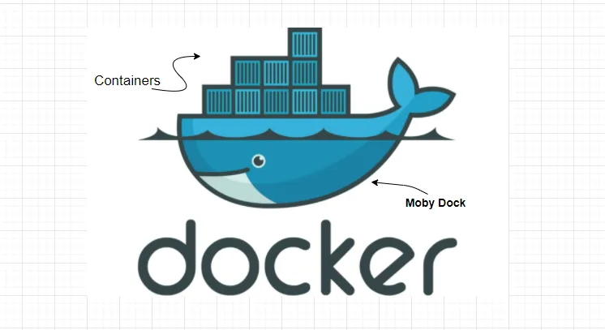
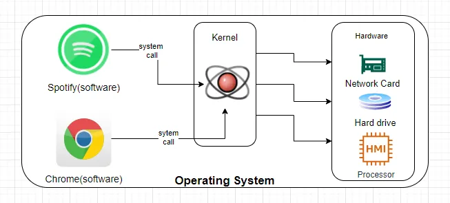
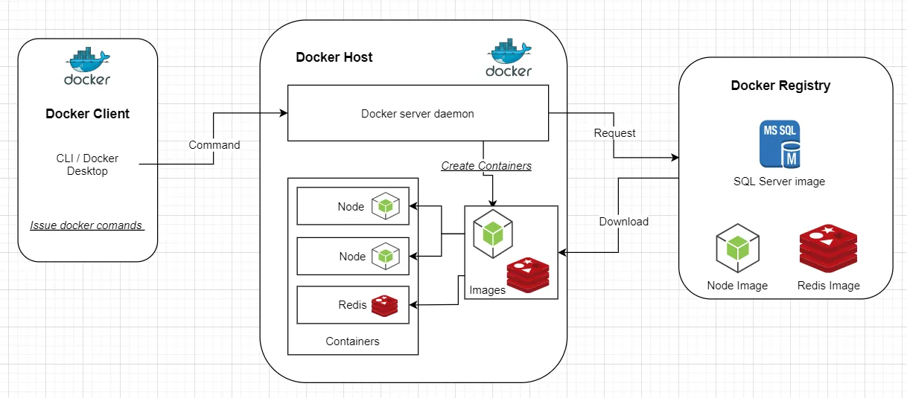

# Understanding Docker

As a developer, you must have experienced at least once where your app works great on your local/development machine but fails to work on the production?

Pulling your hair out of frustration, have you ever thought of shipping your development machine to production? This is where Docker will help you.

Well, Docker doesn't ship your development machine to production, no! But what it does is, enables you to separate your applications from your infrastructure so you can deliver software quickly. Docker makes it very easy to distribute and install software on a computer environment.

> **Docker is an open platform for developing, shipping, and running applications**

## Understanding the underlying technology behind the Docker platform

**Docker platform** provides the ability to package and run an application in a loosely isolated environment called a container. A container is a standard unit of software that packages up code and all its dependencies so the application runs quickly and reliably from one computing environment to another. **Containers** are lightweight and contain everything needed to run the application, so you do not need to rely on what is currently installed on the host.

> Docker provides tooling and a platform to manage the lifecycle of your containers.

Docker makes use of a technology called *namespaces* to provide the isolated workspace(containers). When you run a container, Docker creates a set of namespaces for that container. These namespaces provide a layer of isolation. Each aspect of a container runs in a separate namespace and its access is limited to that namespace. The isolation and security allow you to run many containers simultaneously on a given host.

However, to run a container on a host, the container should be created first. This is where *Docker Images* show up. A Docker image is a read-only binary file that includes all of the instructions for creating a Docker container. Docker containers only have access to resources defined in the image. Think of it as a blueprint of a model of a car produced in a factory. The blueprint (image) can be used to produce cars (containers) by the factory (Docker) but will be limited to the design in the blueprint.

> **A container is a runnable instance of an image and, often an image can be based on another image**

## Let’s talk more about containers

To discuss containers, we need to first understand the basics of how an Operating System works. Most operating systems have something called a kernel which is a process that governs access to all the software running on the computer and the hardware resources connected to the computer. The kernel acts as this intermediate layer that manages the communication between the software running on the machine and the hardware connected to it.

If you take a look at the drawing above, you will notice that software like Chrome or Spotify is making system calls to the kernel which in turn is making the necessary low-level interactions with the hardware resources. They do not have direct access to the resources and have to go through the intermediate layer that abstracts the underlying hardware by exposing endpoints for the software to make the system calls. We had previously discussed the concept of namespaces. With Linux namespaces, we are allowed to isolate resources (eg. hardware resources like the hard drive ) per-process level. This is not essentially only for hardware but also the system software elements as well.

Another important concept that is very close to the namespace is the **Control Groups**(cggroups). This is a Linux kernel feature that allows you to allocate resources — such as CPU time, system memory, network bandwidth, or combinations of these resources — among user-defined groups of tasks (processes) running on a system.

With these two two kernel features, we can effectively govern and limit the access to resources per process. Hence a container can be defined as a process or a set of processes that are grouped together in such a way that they have access to a segment of resources (both hardware and software) specifically allocated to it hence effectively isolating it from the other processes and also other containers running on the same operating system.

## Docker Architecture

The Docker platform is built on client-server architecture.

The **_Docker client_**(a CLI process running on the host machine) will communicate with the **_Docker host_** which contains a **_daemon process_**. This daemon does all the work of building and running the containers, managing the images, and all the necessary tasks to efficiently run the Docker system.

The client can run on the same machine which has the daemon(server) or it can also communicate with a remote daemon. The communication is established using REST API, Unix Sockets, or a network interface. The client can communicate with more than one daemon as well.

