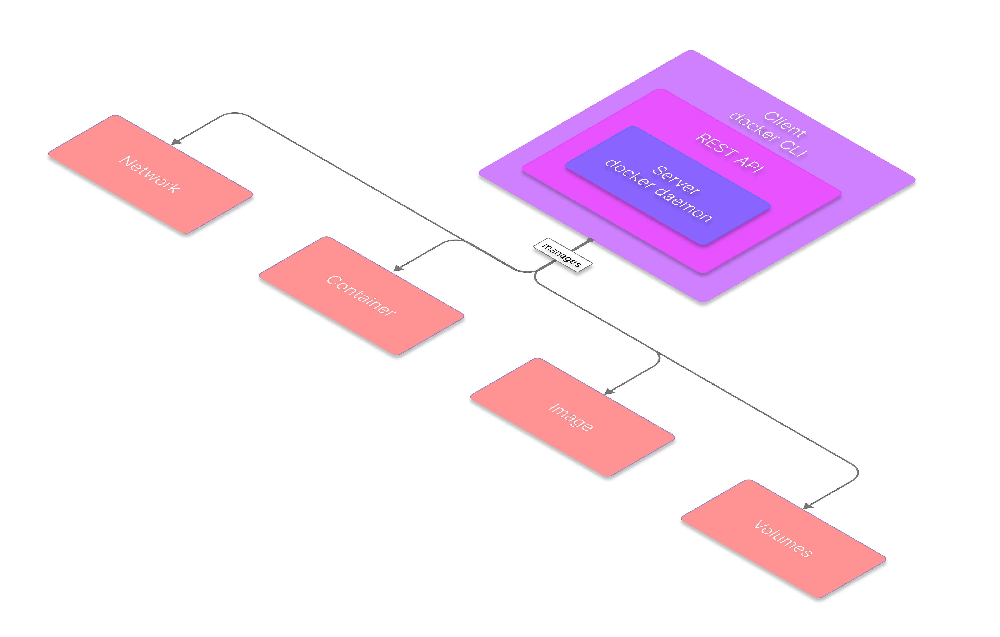

## Docker CLI: A Powerful Tool for DevOps and Cloud Computing to Manage Containers, Images, Volumes, and Networks with Ease

**Docker CLI (Command Line Interface)**, which is a command line application that allows you to interact with the Docker daemon.

The Docker daemon is the process that runs in the background and manages all the containers and their resources.

The Docker CLI communicates with the Docker daemon through an API endpoint, sending commands and receiving responses.

## Why use Docker CLI?

The Docker CLI provides a comprehensive set of commands that cover various aspects of container management, such as:

* Building and managing images

* Creating and running containers

* Inspecting and modifying containers

* Stopping and removing containers

* Managing networks and volumes

* Managing Swarm clusters and services

* Managing secrets and configs

* Managing images on Docker Hub or other registries

## Overview



Docker CLI is a client-server application that communicates with the Docker daemon, which is a background process that runs on the host machine and manages the containers.

The Docker daemon exposes a REST API that the Docker CLI uses to send commands and receive responses.

The Docker CLI can also communicate with remote Docker daemons, either by using the `DOCKER_HOST` environment variable or by specifying the `-H` flag in the command.

For example, to run a command on a remote daemon with the IP address `192.168.1.100`, you can use:

```
docker -H tcp://192.168.1.100:2375 <command>
```

The Docker CLI supports various commands that can be grouped into categories:

* **General commands:** Provides information about Docker and its components
Image commands: Commands that deal with images, which are the templates for creating containers

* **Container commands:** Commands that deal with containers, which are the instances of images that run on the host machine

* **Network commands:** Commands that deal with networks, which are the ways that containers can communicate with each other and with the outside world

* **Volume commands:** Commands that deal with volumes, which are the persistent storage for containers

* **Service commands:** Scale and load-balance containers across multiple hosts in a swarm mode cluster

* **Stack commands:** Deploy multiple services as a single unit in a swarm mode cluster

## Most common used Docker CLI commands

### Images

| Command          | Description                                                         | Example                          |
| ---------------- | ------------------------------------------------------------------- | -------------------------------- |
| `docker build`   | Build an image from a Dockerfile                                    | `docker build -t myapp .`        |
| `docker diff`    | Inspect changes to files or directories on a container’s filesystem | `docker diff myapp`              |
| `docker history` | Show the history of an image                                        | `docker history ubuntu`          |
| `docker images`  | List images                                                         | `docker images -a`               |
| `docker inspect` | Return low-level information on Docker objects                      | `docker inspect ubuntu`          |
| `docker load`    | Load an image from a tar archive or `STDIN`                         | `docker load -i myapp.tar`       |
| `docker pull`    | Pull an image or a repository from a registry                       | `docker pull ubuntu:latest`      |
| `docker push`    | Push an image or a repository to a registry                         | `docker push myapp:latest`       |
| `docker rmi`     | Remove one or more images                                           | `docker rmi ubuntu`              |
| `docker run`     | Run a command in a new container from an image                      | `docker run -it ubuntu bash`     |
| `docker save`    | Save one or more images to a tar archive                            | `docker save -o myapp.tar myapp` |
| `docker tag`     | Create a tag `TARGET_IMAGE` that refers to `SOURCE_IMAGE`           | `docker tag ubuntu myapp:base`   |

### Containers


| Command          | Description                                                                   | Example                                     |
| ---------------- | ----------------------------------------------------------------------------- | ------------------------------------------- |
| `docker attach`  | Attach local standard input, output, and error streams to a running container | `docker attach web`                         |
| `docker cp`      | Copy files/folders between a container and the local filesystem               | `docker cp web:/var/log/nginx/access.log .` |
| `docker diff`    | Inspect changes to files or directories on a container's filesystem           | `docker diff web`                           |
| `docker exec`    | Execute a command in a running container                                      | `docker exec web ls /var/www/html`          |
| `docker inspect` | Return low-level information on Docker objects                                | `docker inspect web`                        |
| `docker kill`    | Kill one or more running containers                                           | `docker kill web`                           |
| `docker logs`    | Fetch the logs of a container                                                 | `docker logs web`                           |
| `docker pause`   | Pause all processes within one or more containers                             | `docker pause web`                          |
| `docker port`    | List port mappings or a specific mapping for the container                    | `docker port web 80/tcp`                    |
| `docker ps`      | List containers                                                               | `docker ps`                                 |
| `docker rename`  | Rename a container                                                            | `docker rename web nginx`                   |
| `docker restart` | Restart one or more containers                                                | `docker restart web`                        |
| `docker rm`      | Remove one or more containers                                                 | `docker rm web`                             |
| `docker run`     | Create and run a new container from an image                                  | `docker run -d -p 80:80 --name web nginx`   |
| `docker start`   | Start one or more stopped containers                                          | `docker start web`                          |
| `docker stats`   | Display a live stream of container(s) resource usage statistics               | `docker stats web nginx`                    |
| `docker stop`    | Stop one or more running containers                                           | `docker stop web`                           |
| `docker top`     | Display the running processes of a container                                  | `docker top web aux`                        |
| `docker unpause` | Unpause all processes within one or more containers                           | `docker unpause web`                        |
| `docker update`  | Update configuration of one or more containers                                | `docker update --cpu-shares 512 web`        |

### Networks

| Command      | Description                                             | Example                                            |
| ------------ | ------------------------------------------------------- | -------------------------------------------------- |
| `connect`    | Connect a container to a network                        | `docker network connect my-net my-container`       |
| `create`     | Create a new network                                    | `docker network create --driver bridge my-net`     |
| `disconnect` | Disconnect a container from a network                   | `docker network disconnect -f my-net my-container` |
| `inspect`    | Display detailed information about one or more networks | `docker network inspect my-net`                    |
| `ls`         | List all networks                                       | `docker network ls --filter driver=bridge`         |
| `prune`      | Remove all unused networks                              | `docker network prune -f`                          |
| `rm`         | Remove one or more networks                             | `docker network rm my-net`                         |

### Volumes

| Command                 | Description                                 | Example                                                                |
| ----------------------- | ------------------------------------------- | ---------------------------------------------------------------------- |
| `docker volume create`  | Creates a new volume                        | `docker volume create --driver local --label example=volume my-volume` |
| `docker volume inspect` | Shows information about one or more volumes | `docker volume inspect my-volume`                                      |
| `docker volume ls`      | Lists all volumes                           | `docker volume ls --filter driver=local`                               |
| `docker volume prune`   | Removes all unused volumes                  | `docker volume prune`                                                  |
| `docker volume rm`      | Removes one or more volumes                 | `docker volume rm my-volume`                                           |

### Services

| Command                  | Description                                             | Example                                               |
| ------------------------ | ------------------------------------------------------- | ----------------------------------------------------- |
| `docker service create`  | Create a new service with a specified name and image    | `docker service create --name web --replicas 3 nginx` |
| `docker service inspect` | Display detailed information about one or more services | `docker service inspect web`                          |
| `docker service logs`    | Fetch the logs of a service or a task                   | `docker service logs web`                             |
| `docker service ls`      | List services in the swarm                              | `docker service ls`                                   |
| `docker service ps`      | List the tasks of one or more services                  | `docker service ps web`                               |
| `docker service rm`      | Remove one or more services                             | `docker service rm web`                               |
| `docker service scale`   | Scale one or multiple replicated services               | `docker service scale web=5`                          |
| `docker service update`  | Update the configuration of one or more services        | `docker service update --image nginx:latest web`      |

### Stacks

| Command                 | Description                                                                     | Examples                                            |
| ----------------------- | ------------------------------------------------------------------------------- | --------------------------------------------------- |
| `docker stack deploy`   | Deploy a new stack or update an existing stack from a compose file on the swarm | `docker stack deploy -c docker-compose.yml mystack` |
| `docker stack ls`       | List stacks                                                                     | `docker stack ls`                                   |
| `docker stack ps`       | List the tasks in the stack                                                     | `docker stack ps mystack`                           |
| `docker stack rm`       | Remove one or more stacks                                                       | `docker stack rm mystack`                           |
| `docker stack services` | List the services in the stack                                                  | `docker stack services mystack`                     |


