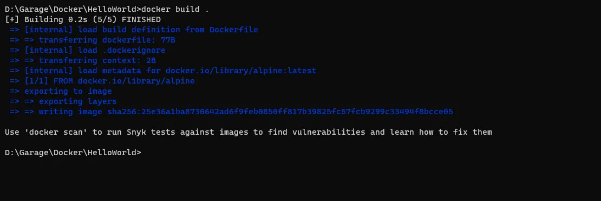
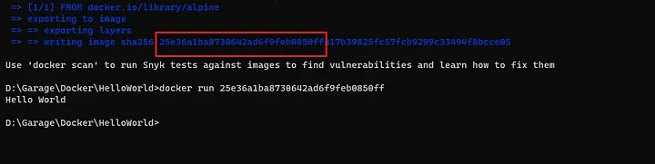
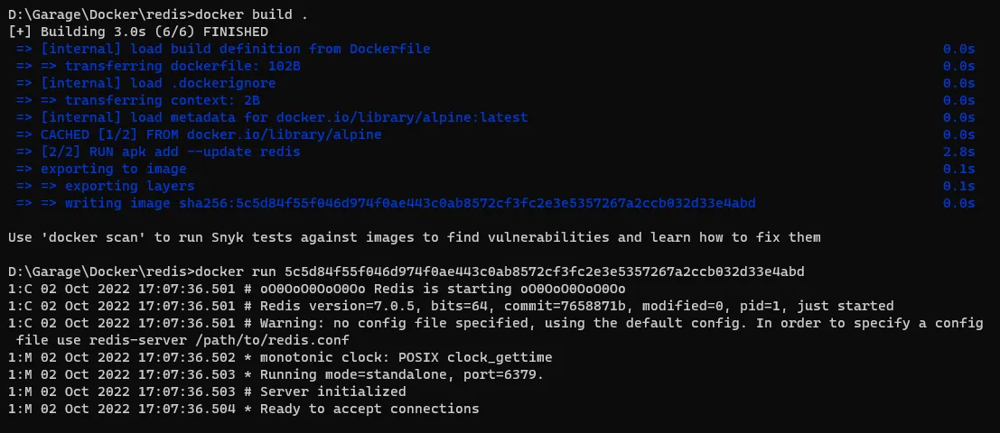

# Building a simple image using Dockerfile
To build our own Docker images, we need to instruct the Docker CLI on how to build it. To achieve this, we must create a specific file with all the instructions. It is called the **Dockerfile**. The Dockerfile is a text file with no extension of any sort. It is simply named “Dockerfile”.

Once we have this file created and set up, the docker CLI can then use this file as input to build images using the command ```docker build```. The images can then be used to create containers.

### Format of Dockerfile instructions
Each line in the Dockerfile build instruction will look something like this:

 ```
 INSTRUCTION <arguments>
 ```

The instruction is not case-sensitive and contains the Build command. The arguments will follow this instruction. Example ```FROM alpine```

Every Dockerfile begins with a `FROM` instruction barring some exceptions which we will discuss later.

### Adding comments in the Dockerfile
You can also add comments to the file using a `#` symbol. Example of a comment `#This is a comment`

Comments are removed from the execution during a preprocessing step before the builder instructions are executed.

### Example 1: A simple Dockerfile looks something like this:

```
#This is the Hello World Dockerfile
FROM alpine
CMD ["echo", "Hello World"]
```
Create this Dockerfile in a local directory and then build this into a Docker image using the command below:

```
docker build .
```
```
docker build -t <name:tag> .
```
> The -t option specifies the name and tag of the image. The format of the tag is :. 

The CLI will search for a Dockerfile in the current directory because of the . (period) at the end of the command. If it finds a Dockerfile, it will build an image Refer to the below log:



Refer to the last line, the string is the ID we can use to refer to the image. Let's try to run a container using this ID.



You can see that the startup command has been executed and has printed the “Hello World” message on the console.

## Understanding the image build phase
The `build` command requires a context to be set. The context can be a PATH which is a location on the local file system or a URL.

In the command, `docker build .` we provide the current directory as context using the `.` at the end of the command.

Typically, the Dockerfile is expected to be present in the build context root directory, however, if the Dockerfile is located somewhere else in the file system, the `-f` flag can be used to supply the location of the Dockerfile.

```
docker build -f C:/path/to/a/Dockerfile .
```
Using a remote Dockerfile is possible by passing a URL to a git repository.
```
docker build https://github.com/nitin-manju/DockerSamples.git#main:HelloWorld
```
Here the Dockerfile is recursively found and the git repository becomes the context. You could also specify the branch and the sub-folder in the repository.

Notice `#main` which specifies the main branch and `:HelloWorld` which specifies the sub-folder. This will checkout the git repository and set the subfolder as the build context.

### Layers in the build process
The above Dockerfile example (1), has `FROM alpine` as the first instruction. Every Dockerfile will usually start with an instruction like `FROM` followed by the name of an image. Here, `alpine` is the name of an image, which is used as the base image, kind of like a base operating system on a computer. This image is based on the _Alpine Linux distribution_ and is officially maintained by Docker. It uses _APK_ as its package manager.

The next instruction that follows is `CMD ["echo", "Hello World"]` where `CMD` is another instruction and `["echo", "Hello World"]` becomes the command.

The docker daemon runs the Dockerfile line by line. Hence committing the output of every step into a new image. Except for the very first step, every consecutive step will create a container instance using the image from the previous step and execute the instruction, resulting in a final image which becomes the output of the Dockerfile build process. These images in the intermediate steps are known as layers.

Let's create a more complex image.Let's use the Redis image to create containers using `docker run redis`. Let us try to create our own Redis image.

### Example 2: Multi-layer Dockerfile
Paste the following lines into a Dockerfile and build it:
```
FROM alpine
RUN apk add --update redis
CMD ["redis-server"]
```
The output should look something like this after you build and create a container from the resulting image.



You notice that the container is running the redis-server command and is ready to accept new connections.