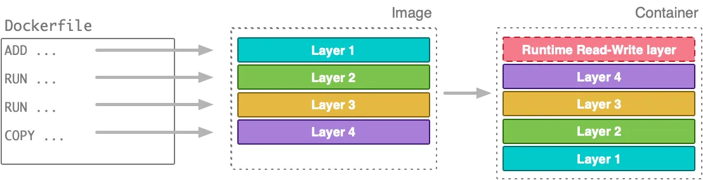
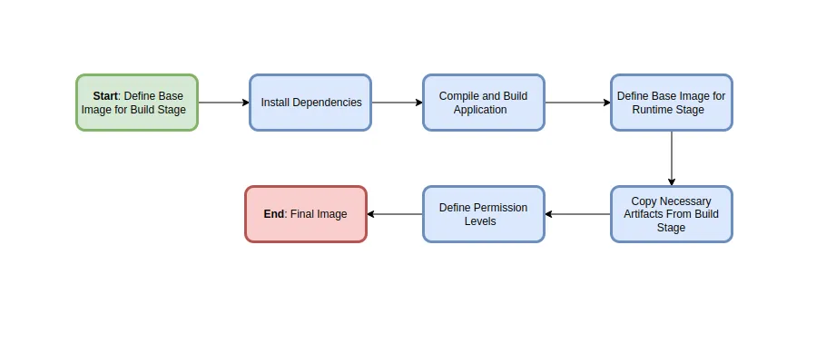
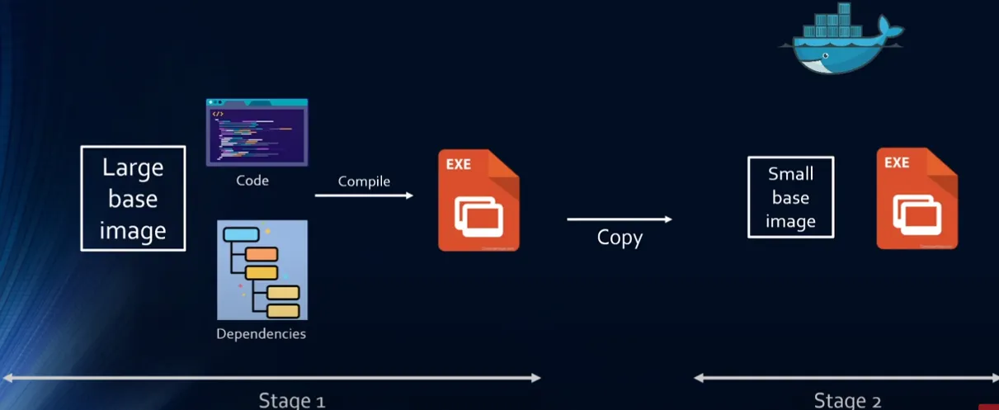

# Docker Multi-Stage Builds



A Docker image is built up from a series of layers. Each layer represents an instruction in the image’s Dockerfile. Each layer except the very last one is read-only.Each of these layers adds to the size of the image

A multistage Docker build is a technique where we will divide our Dockerfile into two stages. One will be the build stage, which will help us to build our application and generate the artifact. And then we will only copy the artifact from the build stage to another stage and create a tiny production image.

Dockerfile could have multiple From and output of one From becomes input to the next From and so on



## Benefits of using Distroless (slimmed-down images) in Multistage Deploy:

Using slimmed-down images in Dockerfiles offers several benefits, contributing to more efficient and secure containerized applications. Here are some advantages:

1. **Reduced Image Size:** Slimmed-down images are designed to be smaller in size compared to their full-sized counterparts. This results in faster image pull times, reduced storage requirements, and quicker deployments. Smaller images are particularly crucial in environments with limited bandwidth or storage capacity.

2. **Faster Build Times:** Building images from smaller base images typically takes less time, as there are fewer layers to download and install. This can significantly improve the speed of your CI/CD pipeline and the overall development lifecycle.

3. **Improved Security:** Slimmed-down images have a smaller attack surface because unnecessary components and tools are excluded. Reducing the number of installed packages and dependencies minimizes potential vulnerabilities, making it more challenging for attackers to exploit security flaws.

4. **Efficient Resource Utilization:** Containers based on slim images consume fewer system resources (CPU, memory, disk space). This efficiency is particularly valuable when deploying applications at scale, allowing for higher container density on a host machine.

5. **Enhanced Network Performance:** Smaller images lead to less data transfer across networks, resulting in improved network performance. This is beneficial in scenarios where containers need to be frequently pulled or pushed, such as in microservices architectures.
6. **Streamlined Maintenance:** Slimmed-down images often come with fewer pre-installed packages and libraries. This can simplify image maintenance and reduce the need for frequent updates, as there are fewer components to monitor and patch.



Let’s create a custom docker image for a simple golang application.

```
# app.go

package main

import (
    "fmt"
    "time"
    "os/user"
)

func main () {
    user, err := user.Current()
    if err != nil {
        panic(err)
    }

    for {
        fmt.Println("user: " + user.Username + " id: " + user.Uid)
        time.Sleep(1 * time.Second)
    }
}
```

Now, let’s write a **Dockerfile** to package the golang application :

```
# Dockerfile

FROM ubuntu   # Base image 
ARG DEBIAN_FRONTEND=noninteractive   
RUN apt-get update && apt-get install -y golang-go    # Install golang
COPY app.go .                                         # Copy source code                 
RUN CGO_ENABLED=0 go build app.go                     
CMD ["./app"]                         
```

Next, Create a docker image and run a container from that image :

```
# Create image from the Dockerfile
>>  docker build -t goapp .
...
Successfully built 0f51e92fe409
Successfully tagged goapp:latest

# Run a container from the image created above
>> docker run -d goapp

04eb7e2f8dd2ade3723af386f80c61bdf6f5d9afe6671011b60f3a61756bdab6
```

Now, ‘`exec`’ into the container we created earlier :

```
# exec into the container
>> docker exec -it 04eb7e2f8dd sh

# list the files
~ ls
app  app.go  bin  boot  dev  etc  home  ...

# run the application 
~ ./app
user: root id: 0
user: root id: 0
user: root id: 0
user: root id: 0
user: root id: 0
...
```

We can see that after building the application we have `app` artifact inside the container. If we check the image size which helped us to build our application artifact :

```
>> docker images goapp

REPOSITORY                  TAG       IMAGE ID       CREATED        SIZE
goapp                       latest    0f51e92fe409   16 hours ago   870MB
```

The image size is ‘`870MB`’, but we can slim this down using multi-stage builds. With multi-stage builds, we will use multiple `FROM` statements in our Dockerfile. Each `FROM` instruction can use a different base, and each of them begins a new stage of the build. We can selectively copy artifacts from one stage to another by leaving everything that we don’t want in the final image. To show how this works, let’s adapt the `Dockerfile` from the previous section to use multi-stage build.

We will divide our `Dockerfile` into two stages. One will be the **build stage**, which will help us to build our application and generate the artifact. And then we will only **copy the artifact from the build stage to another stage and create a tiny production image.**

```
# Dockerfile
# named this stage as builder ----------------------
FROM ubuntu AS builder         
ARG DEBIAN_FRONTEND=noninteractive   
# Install golang
RUN apt-get update && apt-get install -y golang-go   
# Copy source code
COPY app.go .                                             
RUN CGO_ENABLED=0 go build app.go

# new stage -------------------
FROM alpine
# Copy artifact from builder stage                   
COPY --from=builder /app .   
CMD ["./app"]
```

Now, build the image and check the image size :

```
>> docker build -t goapp-prod  .

Successfully built 61627d74f8b8
Successfully tagged goapp-prod:latest

>> docker images goapp-prod

REPOSITORY   TAG       IMAGE ID       CREATED         SIZE
goapp-prod   latest    61627d74f8b8   5 minutes ago   8.92MB  # <---
```

As we can see image size has been reduced significantly. It’s time to check if we can run a container from the image we created.

```
# create docker container
>> docker run goapp-prod

user: root id: 0
user: root id: 0
```
