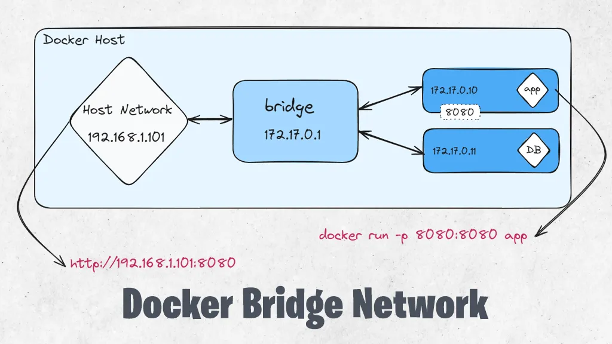
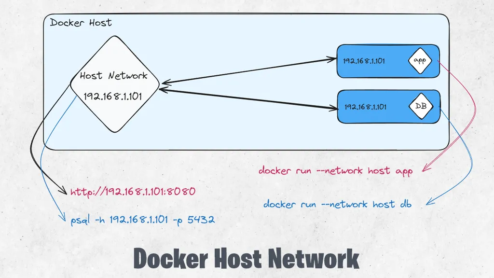
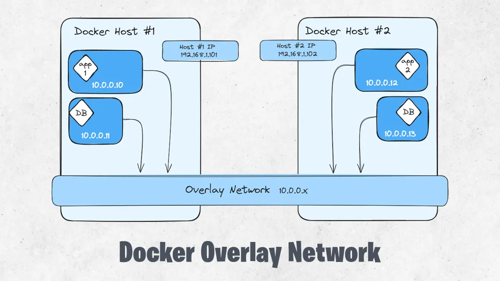
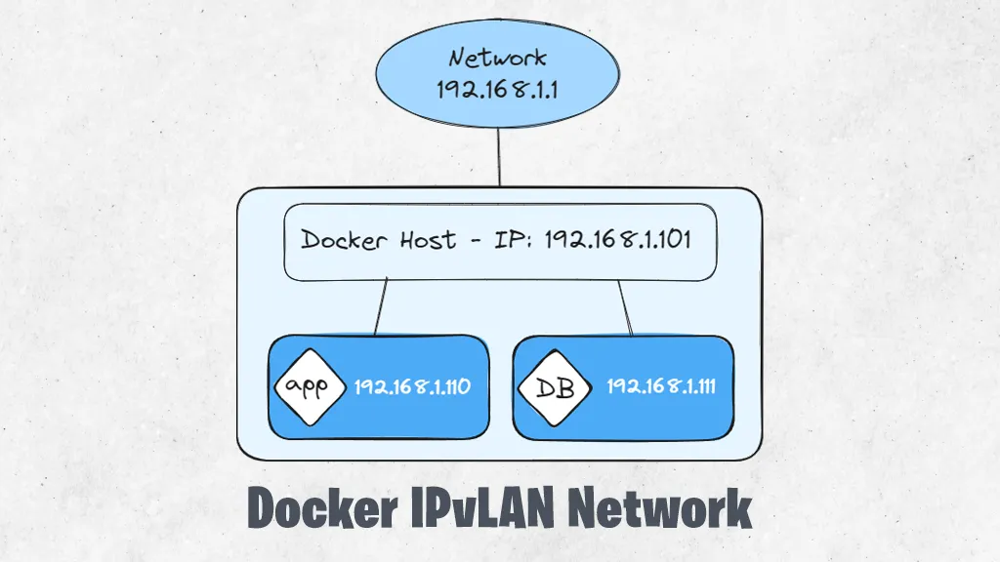

# DOCKER NETWORK MANAGEMENT SYSTEM

Docker comes with a network management system. This system helps in managing communication between containers, the machine hosting Docker, and external networks. It also supports many network types. To have network access, containers need to be part of a Docker network

**Docker provides five standard network drivers for the core networking functions:**

* Bridge
* Host
* Overlay
* IPvLAN
* vMacvlan

## Bridge Network



Bridge networks form a virtual bridge between the host machine and the container. Containers on this network can talk to each other but are cut off from those not on the network.

Each container gets a unique IP address.These containers can also interact with your local network (LAN) and the internet. However, they won’t show up as physical devices on your LAN.

## Host Network



Containers using the host network mode use the same network settings as your host machine, without being isolated. They don’t get separate IP addresses. Instead, any ports they use are directly linked to your host’s network. For example, if a container process uses port 8080 (it will be our app container in this case), it will be accessible at 192.168.1.101:8080, which is your host’s IP address and port number.

Since our app container uses port 8080, there is no need for port mapping as containers in this case use the host ports. Our database uses port 5432 so it can be accessed via the host IP address and 5432 port.

> **Note:** In the host network mode, containers don’t have individual IP addresses. They directly use the host’s IP address and ports. This means any network activity from these containers appears as if it is coming from the host itself

## Overlay Network



Overlay networks are networks that spread across more than one Docker host. They let containers on any of these hosts talk to each other without needing the operating system to manage the routing.

These networks are used in Docker Swarm clusters for networking. But you can also use them if you have two Docker Engines running separately, with containers that need to connect directly. This way, you can create environments similar to Docker Swarm on your own.

The image above keeps things simple. Because in real scenario, just like the containers, the host machines also get virtual IP addresses from the overlay network, and these are in the same range.

## IPvLAN Network



The IPvLAN is an advanced driver that gives you detailed control over the IPv4 and IPv6 addresses for your containers. It also handles layer 2 and 3 VLAN tagging and routing.

This driver is handy if you need to connect container services with a physical network you already have. IPvLAN networks have their own interfaces, which can perform better than networks based on bridge networking.

The image simplifies the concept, but it does show that everything, including containers gets its own IP address in the IPvLAN setup and are part of the network.

## Macvlan Network

Macvlan is a more advanced choice that lets containers act like physical devices on your network. It does this by giving each container its own MAC address.

For this network type, you need to allocate one of your host’s physical network interfaces to the virtual network. Also, the broader network should be set up to handle the many MAC addresses that might come from a Docker host with lots of containers.

## Which Network Type To Use

**Bridge networks** fits most situations well. Containers on these networks can talk to each other using IP addresses and DNS names. They can also connect to the internet and your local network.

**Host networks** are good when you need to directly use your host’s network interfaces and do not need to separate the container’s network. This setup lets containerized apps work like they are part of your host’s network.

**Overlay networks** are necessary for direct communication between containers on different Docker hosts. They are ideal for creating distributed setups for better reliability.

**Macvlan networks** are useful when your containers need to seem like physical devices on your network, like for monitoring network traffic. IPvLAN networks are for advanced needs, like specific control over container IP addresses, tags, and routing.

## Creating Networks

To create a new network, use the `docker network create` command. You can specify the driver to use, such as `bridge` or `host`, by setting the `-d` flag. A bridge network will be created if you omit the flag.

Run the following in your first terminal window:

```
$ docker network create test-network -d bridge
```

The ID of the created network is emitted to your terminal. The new network’s useless at the moment because no containers have been connected.

But you can attach new containers to a network by setting the `--network` flag with your `docker run` command. Run this command in your second terminal window:

```
docker run -it --rm --name container1 --network test-network busybox:latest
```

`--rm`: This flag tells Docker to automatically remove the container when it exits. 

Next, open your third terminal window and start another Ubuntu container, this time without the `--network` flag:

```
$ docker run -it --rm --name container2 busybox:latest
```

Now try communicating between the two containers, using their names:

```
# in container1
/ # ping container2
ping: bad address 'container2'
```

The containers are not in the same network yet, so they can not directly communicate with each other.

Use your first terminal window to join container2 to the network:

```
$ docker network connect test-network container2
```

The containers now share a network, which allows them to discover each other:

```
# in container1
/ # ping container2
PING container2 (172.22.0.7): 56 data bytes
64 bytes from 172.22.0.7: seq=0 ttl=64 time=2.205 ms
```

Docker lets you freely manage network connections without restarting your containers. In the above section, you saw how to connect a container after its creation, it is also possible to remove containers from networks they no longer need to participate in:

```
$ docker network disconnect test-network container2
```

Any changes you make will apply immediately.

And if you want to delete a network, disconnect or stop all the Docker containers that use it, then pass the network’s ID or name to network rm:

```
$ docker network rm test-network
```
So, for the end, docker’s networking system offers different ways to manage how containers communicate with each other, their neighboring containers, and the Docker host. Containers in the same network can connect using their names or IP addresses.

The networking relies on different drivers that can be changed as needed, covering most typical situations. These networks use your host’s network setup but keep things separate using something called namespaces. This separation is not as strong as what you see with virtual machines (VMs), but containers can still seem like physical devices on your network if you use a macvlan network.