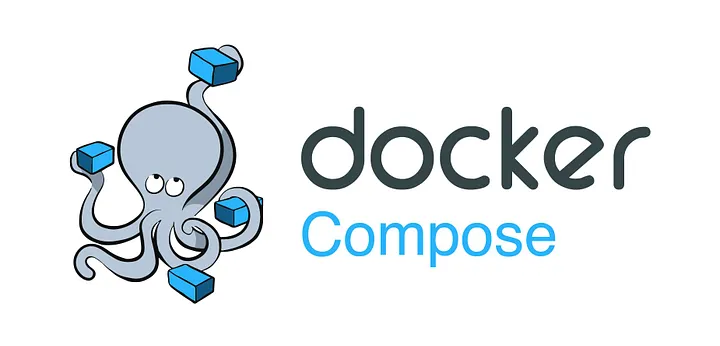

# Docker Compose



 Docker Compose is used to run applications which have multiple containers using a YAML file.There can be several cases where the docker application must run multiple containers for different technology stack. Now building, running, connecting separate dockerfiles for each container can be a difficult task; this is where docker-compose helps you out. Using a single and straightforward docker-compose.yml file, you can build, connect, and launch all the containers by running a single command. This is very useful for enterprise applications in production, where several applications run inside containers. It saves a lot of time by running 100s of application inside docker containers with ease.

## The Docker-compose file:
Like Dockerfile, we use the docker-compose.yml, which has two primary vital areas the version it defines, and the services that represent the container's definitions.

The services are the place to define our containers; it supports additional properties like image, builds, environment, volumes, port, networks, and more.

> In YML files, the indentation matters and always use space.

## Practical Example of Docker-compose file:
Here is an example of `docker-compose.yml` a file that defines a simple web application that consists of two services: `web` and `db`

```
version: 3.8

services:
  web:
    image: nginx
    ports:
      - 80:80
    environment:
      - DB_HOST=db
    depends_on:
      - db
    networks:
      - app-network
  
  db:
    image: postgres
    environment:
      - POSTGRES_PASSWORD=secret
    volumes:
      - db-data:/var/lib/postgresql/data
    networks:
      - app-network

networks:
  app-network:
    driver: bridge
    ipam:
      config:
        - subnet: 172.16.0.0/24

volumes:
  db-data:
```

To run your application with Docker Compose, you need to navigate to the directory where your YAML file is located and execute the following command:

```
docker-compose up
```

This command will pull the images from the Docker Hub or a private registry if they are not already present on your machine, create and start the containers according to the configuration in the YAML file, and attach them to their logs. You can also use the -d flag to run the containers in detached mode, which means they will run in the background without blocking your terminal.

To stop your application with Docker Compose, you need to execute the following command:

```
docker-compose down
```

This command will stop and remove the containers created by docker-compose up. You can also use the `-v` flag to remove any volumes associated with the containers.

## Best Practices:
#### 1)Use environment variables in your YAML file to make it more dynamic and flexible
Description: Use ${PORT} to refer to the port number that is set in an environment variable named PORT. You can also use .env files to store your environment variables in a separate file.

#### 2)Use .env files to store environment variables that you don't want to expose
Description: Create a .env file in the same directory as your docker-compose.yml file and write POSTGRES_PASSWORD=secret in it. Then, you can reference this variable in your docker-compose.yml file as ${POSTGRES_PASSWORD}.

#### 3)Use volumes to persist data across container restarts or share data between containers
Description: Use volumes to store the database data or the web server configuration. You can define named volumes in the top-level volumes section of your YAML file and then reference them in your services. You can also use bind mounts to mount a directory or a file from your host system into your containers.

#### 4)Use networks to isolate and connect your services
Description: Use networks to restrict the communication between your services or to enable communication with external services. You can define custom networks in the top-level networks section of your YAML file and then reference them in your services. You can also use the default network that is created by Docker Compose for your application.

#### 5)Use labels to add metadata to your containers, networks, and volumes
Description: Use labels to identify the owner, purpose, or version of your resources. You can define labels in the labels section of your YAML file and then use them to filter or group your resources.

#### 6)Use .gitignore files to exclude files or directories that you don’t want to commit
Description: Create a .gitignore file in the same directory as your docker-compose.yml file and write .env and db-data/* in it. Then, these files or directories will not be tracked by Git.

#### 7)Use health checks to monitor the status of your services
Description: Use health checks to determine if a service is ready, healthy, or unhealthy. You can define health checks in the health check section of your YAML file and then use them to control the startup order, restart policy, or scaling behavior of your services.
