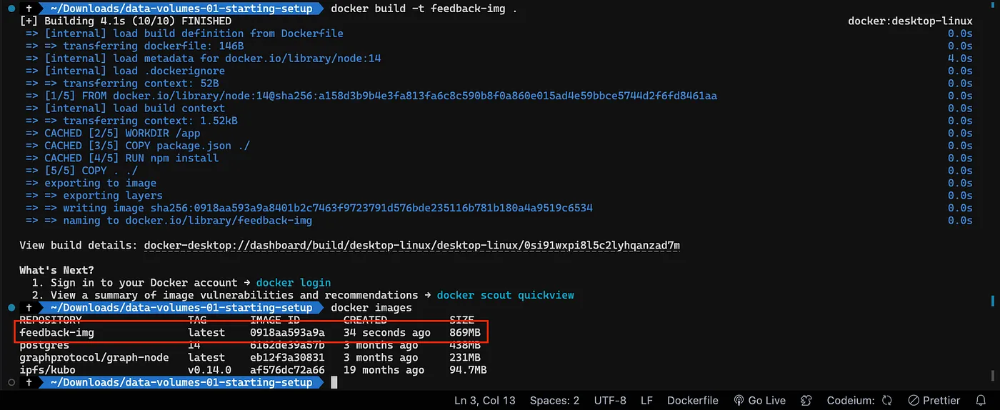

# Understanding Docker Volumes: Anonymous Volumes, Named Volumes, and Bind Mounts

Docker images are read-only. Once they’re created, they can’t change. This means you have to rebuild them to update them.

Containers, on the other hand, can read and write. They add a thin “read-write layer” on top of the image. That means they can make changes to the files and folders in the image without actually changing the image.

But even with read-write containers, two big problems occur in many applications using Docker.

* Data written in a Container doesn’t persist: If the container is stopped and removed, all data written in the container is lost.
* The container can’t interact with the host filesystem: If you change something in your host project folder, those changes are not reflected in the running container. You need to rebuild the image and start a new container.
 
`Problem 1` can be solved with a Docker feature called `‘Volumes’`. `Problem 2` can be solved by using ‘Bind Mounts’.

## Volumes

Volumes are folders (and files) manages on your host machine which are connected to folders/files inside of a container.

There are two types of Volumes:

1. **Anonymous Volumes:** Created via `-v /some/path/in/container` and removed automatically when a container is removed because of `--rm` added on the docker run command.

2. **Names Volumes:** Created via `-v some-name:/some/path/in/container` and Not removed automatically.

With volumes, data can be passed into a container (if the folder on the host machine is not empty) and it can be saved when written by a container (changes made by the container are reflected on your host machine).

`Volumes` are created and managed by Docker — as a developer, you don’t necessarily know where exactly the folders are stored on your host machine. Because the data stored in there is not meant to be viewed or edited by you — use “`Bind Mounts`” if you need to do that!

**Instead, especially Named Volumes can help you with persisting data.**

Since data is not just written in the container but also on your host machine, the data survives even if a container is removed (because the Named Volume isn’t removed in that case). Hence you can use Named Volumes to persist container data (e.g. log files, uploaded files, database files etc)

Anonymous Volumes can be useful for ensuring that some Container-internal folder is not overwritten by a “Bind Mount” for example (Will be discussed later in the article).

By default, Anonymous Volumes are removed if the Container was started with the `- -rm `option and was stopped thereafter. They are not removed if a Container was started (and then removed) without that option.

Named Volumes are never removed, you need to do that manually (via `docker volume rm VOL_NAME` ).

Example of Usage of Volumes (Named Volumes)

I have a simple Node.js application to get user `feedback` and store it as a `.txt` file in a folder named ‘`feedback`’. After saving the `.txt file`, user can see the file using `/feedback/FILE_NAME.txt path`.


### Dockerfile

```
FROM node:14
WORKDIR /app
COPY package.json ./
RUN npm install
COPY . ./
EXPOSE 8000
CMD ["npm", "start"]
```

### server.js

```
const fs = require('fs').promises;
const exists = require('fs').exists;
const path = require('path');

const express = require('express');
const bodyParser = require('body-parser');

const app = express();

app.use(bodyParser.urlencoded({ extended: false }));

app.use(express.static('public'));
app.use('/feedback', express.static('feedback'));

app.get('/', (req, res) => {
  const filePath = path.join(__dirname, 'pages', 'feedback.html');
  res.sendFile(filePath);
});

app.get('/exists', (req, res) => {
  const filePath = path.join(__dirname, 'pages', 'exists.html');
  res.sendFile(filePath);
});

app.post('/create', async (req, res) => {
  const title = req.body.title;
  const content = req.body.text;

  const adjTitle = title.toLowerCase();

  const tempFilePath = path.join(__dirname, 'temp', adjTitle + '.txt');
  const finalFilePath = path.join(__dirname, 'feedback', adjTitle + '.txt');

  await fs.writeFile(tempFilePath, content);
  exists(finalFilePath, async (exists) => {
    if (exists) {
      res.redirect('/exists');
    } else {
      await fs.copyFile(tempFilePath, finalFilePath);
      await fs.unlink(tempFilePath);
      res.redirect('/');
    }
  });
});

app.listen(8000);
```

I built the Docker image with a tag called feedback-img.

```
docker build -t feedback-img .
```



Now I am going to run this application as the usual way we run the Docker container.

```
docker run -p 3000:8000 — name feedback-app — rm -d feedback-img
```


This is the application running inside the container. Now I can provide feedback, and it will be saved inside the `feedback` directory.


Using `/feedback/hello_world.txt`, I can access the feedback I provided.


As you can see, there is no issue. We can access the written `.txt` file without any problem.

Now I am going to stop the running container and run a container again using the same image we built before.


Theoretically, I should be able to access my `hello_world.txt` file again, since it was a record we previously entered and should not be deleted.


But there is `no hello_world.txt` file in our feedback directory. This is where volumes come into play.

> **Since the data should persist even when we stop the container, we can use a Named Volume for this scenario.**

```
docker run -p 3000:8000 — name feedback-app — rm -d -v feedback:/app/feedback feedback-img
```

Here:

`-v feedback:/app/feedback`: This option mounts a volume named feedback from the host machine to the `/app/feedback` directory inside the container.

The reason to use the `/app/feedback` path inside the container is that we use `/app` as the working directory inside the container (check the Dockerfile).

Now when I give the same feedback again as hello_world.txt, even when I stop and start a container again, the given feedback is still there.


You can always inspect Volumes by running this command:

```
docker volume ls
```


## Bind Mounts

Bind Mounts are very similiar to Volumes — the key difference is, that you, the developer, set the path on your host machine that should be connected to some path inside of a Container.

You do that via `-v` 
`/absolute/path/on/your/host/machine:/some/path/inside/of/container` .

The path in front of the ‘:’ (i.e. the path on your host machine, to the folder that should be shared with the container) has to be an absolute path when using `-v` on the docker run command.

Bind Mounts are very useful for sharing data with a Container which might change whilst the container is running — e.g. your source code that you want to share with the Container running your development environment.

Don’t use Bind Mounts if you just want to persist data — Named Volumes should be used for that (exception: You want to be able to inspect the data written during development).

In general, Bind Mounts are a great tool during development — they’re not meant to be used in production (since your container should run isolated from its host machine).

Example of Usage of Bind Mounts & Anonymous Volumes
I use the same application I used in the previous example of Volumes.

Suppose I want to reflect the changes I am doing in the source code in the running application inside the container.

If you are a Node.js developer, you know about nodemon. It is a tool that helps develop Node.js based applications by automatically restarting the node application when file changes in the directory are detected.

But there is no use of using this tool if you are running the application inside a container without using a bind mount. You always have to rebuild the images with the changes to reflect the changes inside the container.

This is how you can use bind mounts to avoid that:

`docker run -p 3000:8000 — name feedback-app -d -v feedback:/app/feedback -v /Users/kavindumadushanka/Downloads/data-volumes-01-starting-setup:/app feedback-img`

`-v /Users/kavindumadushanka/Downloads/data-volumes-01-starting-setup:/app`: This option mounts a directory from the host machine (/Users/kavindumadushanka/Downloads/data-volumes-01-starting-setup) to the /app directory inside the container. This allows the container to access files or data from the specified directory on the host machine.

Instead of using the absolute path here, you can also use these:

* macOS / Linux: -v $(pwd):/app
* Windows: -v "%cd%":/app

But when I run the above command, the container automatically stops. When I check Docker logs, these are the logs:


As you can see, it’s telling that it can’t find the nodemon module inside it. The reason behind it is this:

Since we don’t have `node_modules` inside our host machine directory, when we run the above command, we override the `/app` directory with the files from our host directory. In that case, the installed `node_modules` directory vanishes when we run this.

So all these

```
COPY package.json ./
RUN npm install
COPY . ./
```

steps are worthless if we bind this mount with our local folder. That’s why we are getting that error when we try to run the container using bind mount. We can use an anonymous volume as a solution to that problem.

`docker run -p 3000:8000 — name feedback-app -d -v feedback:/app/feedback -v /Users/kavindumadushanka/Downloads/data-volumes-01-starting-setup:/app -v /app/node_modules feedback-img`

`-v /app/node_modules`: Mounts the` node_modules `directory from within the container. By mounting this directory, it ensures that the dependencies are available within the container.

Now if you run `docker volume ls` you can see the named volume and the anonymous volume like this:


Now you can change your source code and reflect your changes in the application running inside the container on the go.


Do changes on the go

Therefore, even if there is no node_modules directory in `/Users/kavindumadushanka/Downloads/data-volumes-01-starting-setup`, Docker ensures that the `node_modules` directory in the container remains intact by using the anonymous volume.

## Key Docker Commands

* `docker run -v /path/in/container IMAGE` : Create an Anonymous Volume inside a Container

* `docker run -v some-name:/path/in/container IMAGE` : Create a Named Volume (named some-name ) inside a Container

* `docker run -v /path/on/your/host/machine:path/in/container IMAGE` : Create a Bind Mount and connect a local path on your host machine to some path in the Container

* `docker volume ls` : List all currently active / stored Volumes (by all Containers)

* `docker volume create VOL_NAME` : Create a new (Named) Volume named VOL_NAME . You typically don’t need to do that, since Docker creates them automatically for you if they don’t exist when running a container.

* `docker volume rm VOL_NAME` : Remove a Volume by it’s name (or ID)

* `docker volume prune` : Remove all unused Volumes (i.e. not connected to a currently running or stopped container)