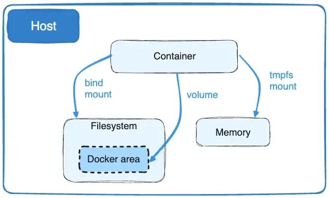

# Docker Volume


A Docker volume is a mechanism for persisting data generated by and used by Docker containers.Volumes provide a way to store and share data between containers, as well as between a container and the Docker host system. They are designed to overcome the ephemeral nature of container filesystems, ensuring that data remains intact even when containers are stopped, removed, or replaced.

Volumes are folders (and files) manages on your host machine which are connected to folders/files inside of a container.

In addition, volumes are often a better choice than persisting data in a container’s writable layer, because a volume doesn’t increase the size of the containers using it, and the volume’s contents exist outside the lifecycle of a given container.

## Volumes have several advantages over bind mounts:

* Volumes are easier to back up or migrate than bind mounts.

* You can manage volumes using Docker CLI commands or the Docker API.

* Volumes work on both Linux and Windows containers.

* Volumes can be more safely shared among multiple containers.

* Volume drivers let you store volumes on remote hosts or cloud providers, encrypt the contents of volumes, or add other functionality.

* New volumes can have their content pre-populated by a container.

* Volumes on Docker Desktop have much higher performance than bind mounts from Mac and Windows hosts.

##  use cases for volumes

Volumes are the preferred way to persist data in Docker containers and services. Some use cases for volumes include:

* Sharing data among multiple running containers. If you don’t explicitly create it, a volume is created the first time it is mounted into a container. When that container stops or is removed, the volume still exists. Multiple containers can mount the same volume simultaneously, either read-write or read-only. Volumes are only removed when you explicitly remove them.

* When the Docker host is not guaranteed to have a given directory or file structure. Volumes help you decouple the configuration of the Docker host from the container runtime.

* When you want to store your container’s data on a remote host or a cloud provider, rather than locally.

* When you need to back up, restore, or migrate data from one Docker host to another, volumes are a better choice. You can stop containers using the volume, then back up the volume’s directory (such as /var/lib/docker/volumes/<volume-name>).

* When your application requires high-performance I/O on Docker Desktop. Volumes are stored in the Linux VM rather than the host, which means that the reads and writes have much lower latency and higher throughput.

* When your application requires fully native file system behavior on Docker Desktop. For example, a database engine requires precise control over disk flushing to guarantee transaction durability. Volumes are stored in the Linux VM and can make these guarantees, whereas bind mounts are remoted to macOS or Windows, where the file systems behave slightly differently.



If your container generates non-persistent state data, consider using a tmpfs mount to avoid storing the data anywhere permanently, and to increase the container’s performance by avoiding writing into the container’s writable layer.

Volumes use `rprivate` bind propagation, and bind propagation isn't configurable for volumes.

##  Choose the -v or — mount flag

In general, `--mount` is more explicit and verbose. The biggest difference is that the `-v` syntax combines all the options together in one field, while the `--mount` syntax separates them. Here is a comparison of the syntax for each flag.

If you need to specify volume driver options, you must use `--mount`.

 * `-v` or `--volume`: Consists of three fields, separated by colon characters `(:)`. The fields must be in the correct order, and the meaning of each field isn't immediately obvious.

* In the case of named volumes, the first field is the name of the volume, and is unique on a given host machine. For anonymous volumes, the first field is omitted.

* The second field is the path where the file or directory are mounted in the container.

* The third field is optional, and is a comma-separated list of options, such as `ro`. These options are discussed below.

`--mount`: Consists of multiple key-value pairs, separated by commas and each consisting of a `<key>=<value>` tuple. The `--mount` syntax is more verbose than `-v` or `--volume`, but the order of the keys isn't significant, and the value of the flag is easier to understand.

* The `type` of the mount, which can be `bind, volume, or tmpfs`. This topic discusses volumes, so the type is always `volume`.

* The `source` of the mount. For named volumes, this is the name of the `volum`e. For anonymous volumes, this field is omitted. Can be specified as `source` or `src`.

* The `destination` takes as its value the path where the file or directory is mounted in the container. Can be specified as `destination`, `dst`, or `target`.

* The `volume-opt` option, which can be specified more than once, takes a key-value pair consisting of the option name and its value.

## Differences between -v and — mount behavior

The `-v` and `--mount` options in Docker are both used to mount volumes into containers, but they differ in behavior and flexibility:

1. Syntax:

`-v`: This is the traditional syntax for mounting volumes in Docker. It takes the format `-v <volume_name>:<container_path>`.
`--mount`: This option provides a more flexible syntax for mounting volumes, allowing for more advanced configurations. It takes the format `--mount type=<volume_type>,source=<volume_source>,target=<container_path>.``

2. Support for Volume Types:

`-v`: The `-v` option only supports mounting named volumes and host directories into containers.
`--mount`: The `--mount` option supports mounting various types of volumes, including named volumes, host directories, and volumes from volume drivers.

3. Flexibility:

`-v`: While straightforward and easy to use, the`-v` option has limited flexibility in terms of specifying volume options and configurations.
`--mount`: The `--mount` option offers greater flexibility by allowing you to specify additional volume options such as volume type, read-only mode, and propagation mode. This makes it suitable for more complex volume mounting scenarios.

4. Docker Compose Compatibility:

`-v`: The `-v` option is commonly used in Docker Compose files and is supported across different Docker versions.
`--mount`: The `--mount` option is also supported in Docker Compose files but may require slightly different syntax compared to `-v`.

## Create and manage volumes

Creating and managing volumes in Docker is essential for persisting data and enabling data sharing between containers.

1. **Create a Volume:** You can create a named volume using the docker volume create command followed by the desired volume name.

``
docker volume create my_volume
```

Alternatively, you can let Docker create the volume automatically when you run a container that references a volume that doesn't exist yet.

2. **List Volumes:** To list all volumes on your system, you can use the docker 
`volume ls` command:

```
docker volume ls

local               my-volume
```

3. **Inspect a Volume:** You can inspect detailed information about a specific volume using the docker volume inspect command followed by the volume name or ID.

```
docker volume inspect my_volume
```

```
[
    {
        "Driver": "local",
        "Labels": {},
        "Mountpoint": "/var/lib/docker/volumes/my-volume/_data",
        "Name": "my-volume",
        "Options": {},
        "Scope": "local"
    }
]
```

4. **Remove a Volume:** To remove a volume, you can use the docker volume rm command followed by the volume name or ID.

```
docker volume rm my_volume
```

Make sure no containers are currently using the volume you intend to remove, as Docker won’t allow you to remove volumes that are in use.

5. **Mount a Volume in a Container:** When running a container, you can specify a volume to mount using the `-v` or `--mount` flag in the docker run command. For example:

```
docker run -v my_volume:/path/in/container my_image
```
This command mounts the my_volume volume into the container at the specified path `(/path/in/container)`.

## Start a Container with Volume:

If you start a container with a volume that doesn’t yet exist, Docker creates the volume for you. The following example mounts the volume `myvol2` into `/app/` in the container.

The `-v` and `--mount` examples below produce the same result. You can't run them both unless you remove the `devtest` container and the`myvol2` volume after running the first one.

With `-v`

```
docker run -d \
  --name devtest \
  -v myvol2:/app \
  nginx:latest
With --mount
```

```
docker run -d \
  --name devtest \
  --mount source=myvol2,target=/app \
  nginx:latest
```

Use `docker inspect devtest` to verify that Docker created the volume and it mounted correctly. Look for the `Mounts` section:

```
"Mounts": [
    {
        "Type": "volume",
        "Name": "myvol2",
        "Source": "/var/lib/docker/volumes/myvol2/_data",
        "Destination": "/app",
        "Driver": "local",
        "Mode": "",
        "RW": true,
        "Propagation": ""
    }
],
```

Stop the container and remove the volume. Note volume removal is a separate step.

```
$ docker container stop devtest
```

Delete the Container:

```
$ docker container rm devtest
```

Remove the Volume:

```
$ docker volume rm myvol2
```